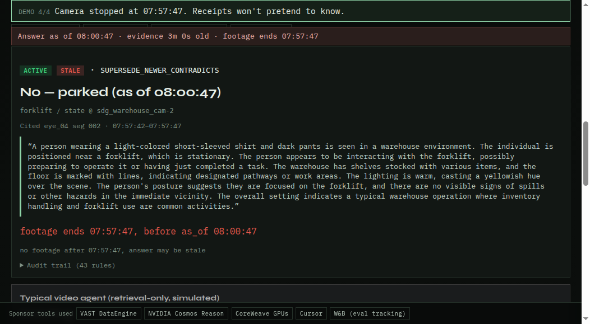
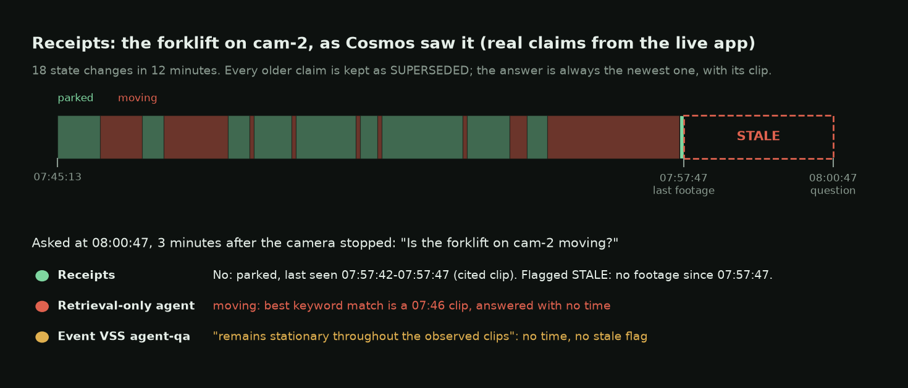
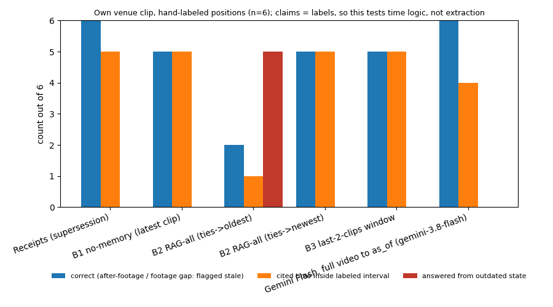

# Receipts

**Video answers that know when they're out of date.** Every answer cites the exact clip and timestamps it came from. When newer footage contradicts it, the answer changes and shows both clips. When the footage stops, it says so instead of guessing.

- **Live app:** https://team-5-app.thecosmoslabs.com/app/ (press **Run demo**)
- **Demo video:** _link added at submission_
- **Eval run (W&B):** https://wandb.ai/harshrofff-na/receipts-vast-hack/runs/kvzklxkd
- **Team:** Harsh Shroff, Yuri Shlyakhter, Zain

Built at the Real-Time Video Agents Hack NYC (VAST Builders Challenge), 2026-10-09.

## The problem

Video agents answer from whatever footage they retrieved, and they answer with confidence. If a pallet was blocking the north exit at 10:05 and was moved at 10:40, an agent that retrieves the 10:05 clip tells you the exit is blocked. Nothing in the answer says the evidence is old, that newer footage contradicts it, or that the cameras stopped recording at 10:42. In a safety or operations setting that stale answer is worse than no answer.

## How it works

1. **Footage becomes claims.** Each clip is passed to a vision-language model (NVIDIA Cosmos Reason) which returns structured claims: entity, attribute, value, location, and the second range where it was seen. Optional YOLO tracks can add zone-occupancy claims.
2. **Claims carry provenance.** Every claim is stored with its source clip, timestamps and confidence in SQLite.
3. **Supersession.** The key is (entity, attribute, location). A later clip with a different value marks the old claim `superseded`. Nothing is deleted. A repeat of the same value corroborates and raises confidence. Every decision is written to an audit table with a rule ID.
4. **Answers cite and flag.** `answer()` only sees footage up to the question time. It returns the latest claim, its clip and timestamps, and a STALE flag when the last confirmation is older than `max_age` or the footage ends before the question time ("no footage after 10:42, answer may be stale"). No claim means no answer and no invented clip.

The core is deterministic Python 3 and sqlite3, no model calls. The model only sits at the ingest edge (`ingest_adapter.CosmosSource`).

## Run it

    python3 fixtures/demo_scenario.py        # synthetic: ask, ingest newer clip, ask again, see SUPERSEDED + new clip
    python3 eval/score.py                    # 25-question table, Receipts vs 3 baselines
    python3 -m unittest discover -s tests -v
    python3 run_vss.py                       # Pack C warehouse segments → receipts.db (needs VSS env)
    python3 viewer/ingest_clips.py && python3 viewer/serve.py   # local clip viewer: boxes + claims over time, see viewer/README.md

## Running on VAST

Pack C warehouse safety demo (`sdg_warehouse_cam-2` / `warehouse3`):

1. Env comes from `/config/<team>.config` (`INGRESS_URL`, `USERNAME`, `PASSWORD`, S3/VastDB names). Do not commit secrets.
2. `python3 run_vss.py` logs into the team VSS, pulls explore timelines, maps Cosmos captions → claims, writes `receipts.db`, prints rule results (including `SUPERSEDE_NEWER_CONTRADICTS`).
3. Web UI is deployed on the team cluster (ConfigMap + `python:3.12-slim`, Ingress path `/app`). Open [https://workshop.thecosmoslabs.com](https://workshop.thecosmoslabs.com) and click **App**.
4. Re-ingest of two motion chunks was started with an obstruction prompt; while those captions were still pending index, the adapter uses keyword mapping on existing captions and automatically prefers `BLOCKED`/`CLEAR` + zone names when re-ingest lands.

## Sponsor tools

What this build actually called:

- **VAST** — DataEngine / VSS retrieval API (login, explore, search, stream), VastDB-backed index, S3 chunk/segment buckets
- **NVIDIA Cosmos Reason** — segment captions (`reasoning_content`); **Cosmos Embed** — via hybrid search during discovery
- **YOLO11 detections (VSS pipeline)** — board player overlay via `/api/detections` (normalized boxes synced to `video.currentTime`)
- **CoreWeave** — GPUs serving the reasoner/embedder (and detector) in the team pipeline
- **Cursor** — agent + skills for health, retrieval, re-ingest, and deploy-app-no-registry
- **Weights & Biases** — eval results table and chart logged per run (`eval/compare.py`); example: [run kvzklxkd](https://wandb.ai/harshrofff-na/receipts-vast-hack/runs/kvzklxkd)

Not used: W&B inference, Weave tracing.

## Evaluation, with caveats

Metrics: exact match; Acc@GQA (exact answer AND correct clip AND interval IoU >= 0.5); citation precision; and a stale-claim rate (answers built on a claim already superseded at question time).

| set | questions | Receipts exact | Receipts stale-claim rate | best baseline exact | best baseline stale-claim rate |
|---|---|---|---|---|---|
| synthetic | 25 | 25/25 | 0/23 | 15/25 (RAG-all) | 9/24 |
| own venue clip, hand-labeled | 6 (1 after footage ends) | 6/6 | 0/6 | 5/6 (latest-clip, newest-wins retrieval, last-2 window) | 0/6, but 0/1 flagged the after-footage question as stale |

The venue row uses `clips/person_moving.mp4`, filmed at the event: 6 questions about where one person is relative to a pillar, positions labeled by eye at 2 fps (not by Cosmos or YOLO). All systems get the same claims (the labels), so this row isolates time handling, not caption extraction. Retrieve-everything with oldest-wins ties scored 2/6 and answered 5/6 from an outdated position. Asked 6 s after the clip ended, all four memory baselines answered with confidence; Receipts flagged the answer stale. A Gemini Flash baseline that re-watches the clip cut at the question time (allowed to answer 'unknown') also scored 6/6, with 4/6 citations inside the labeled interval vs 5/6 for Receipts; one of its three runs on the after-footage question is missing (free-tier quota). Receipts reaches the same answers from stored claims without re-reading video per question, and keeps an audit trail. The team VSS agent-qa and an LLM-over-captions baseline were wired (`baselines_vss.py`) but did not return answers in our runs, so they are not scored. Reproduce: `python3 eval/compare.py --db /tmp/eval.db`.

**Gemini Flash watching the video** (`gemini-3.8-flash` via AI Studio, `python3 eval/compare.py --db /tmp/eval.db --gemini`). This system gets pixels, not claims: for each question the clip is cut at the question time (720p, sampled at 2 fps, temperature 0), and the prompt gives the same facts Receipts has: clip clock start, what the video covers, the question time, and Receipts' stale rule in words ("set stale to true if your answer relies on footage that ends before the question time, or on evidence more than 900 seconds older"). It picks one answer from the label vocabulary or "unknown" and cites seconds in the video. Full prompt: `baselines_gemini.PROMPT_FULL`. Result: 6/6, with the after-footage question flagged stale, so it ties Receipts on this set. Its cited interval fell inside the label on 4/6 (r04 cited 5.5–6.5 s against 6–7 s; r06 cited the last position seen). 17 of 18 calls completed: all 3 runs agreed on r01–r05, 2/2 on r06, and the third r06 run hit the free-tier quota (20 requests/day) and is reported missing, not filled in. Raw responses are committed in `eval/out/gemini_cache/`, so `--gemini-offline --gemini-model gemini-3.8-flash` reproduces the row without a key. What this shows: a frontier video model that is told the clock and the rule can apply it on one 9 s clip. It does not show how it behaves without the rule, over hours of footage, or when the question is about state seen many clips ago, which is where a claim store is meant to help. Side-by-side page: `python3 viewer/serve.py`, then open `/compare`.

Read the synthetic row carefully. The labels were written against the same scenario the rule engine runs on, so 25/25 shows the plumbing works, not that the approach generalises. The informative part is how the baselines fail: retrieval-style memory returns the old state when both states are in the index. Real numbers need real labeled clips, and the real-clip row is the only one that should be used to judge the idea. Counts only, small n, no significance claims.

## Limitations

Exact-name entity matching (no entity resolution). Keyword-overlap retrieval in the baselines. Timestamps come from the model and are only roughly accurate. The staleness window (`max_age`) is a per-scene setting. Warehouse claims from stock captions use deterministic keyword mapping until re-ingest obstruction captions finish indexing.

## Stack

NVIDIA Cosmos Reason + Embed / VAST VSS, YOLO11 detections (VSS pipeline), CoreWeave GPUs, Python 3 + SQLite, Cursor.

License: none yet (all rights reserved by default).

